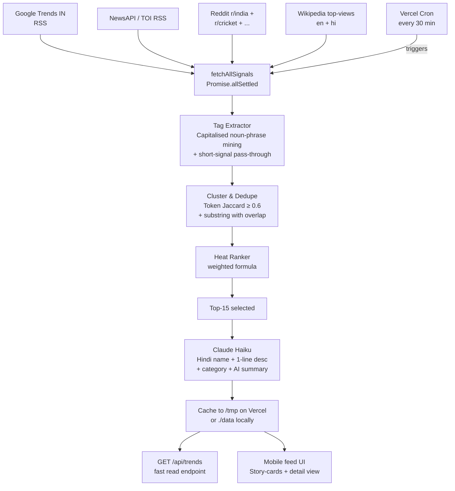

# ShareChat — Trending in Bharat

A trending-tags system + mobile prototype built for the ShareChat APM assignment.

> **Live demo:** _replace with your Vercel URL_
> **Walkthrough video:** _replace with your Loom URL_

---

## What this does

On every load, the app surfaces **what India is talking about right now**, in Hindi, with enough context for a Bharat user to tap a tag and immediately understand why it matters. The output is at least 10 ranked tags per invocation, each with a heat score, category, and source provenance.

The system fuses signals from four independent sources, clusters and ranks them, then enriches the top tags with Hindi via Claude.

---

## How the system decides what's trending

### Sources (4 independent, fused)

| Source | What it gives us | Why include it | Auth |
|---|---|---|---|
| **Google Trends India** (RSS) | Real-time search-intent — what people are typing into Google in India | Strongest "right now" signal; pre-filtered by geography | None |
| **News headlines** (NewsAPI / TOI RSS fallback) | Mainstream India coverage with timestamps | Confirms a topic is "real news" not just chatter | NewsAPI key (free tier) |
| **Reddit r/india + r/cricket + r/bollywood + r/IndiaSpeaks + r/IndianStreetBets** | Engagement-weighted user chatter | Captures Hinglish framing and what Indians are *reacting to*, not just searching | None |
| **Wikipedia pageviews** (en + hi, India-relevant) | Sustained curiosity (24-hr lag) | Anchors trends that have staying power vs. flash-in-pan | None |

I deliberately **excluded Twitter/X** — the API is now $100/mo, signal quality post-2023 is volatile, and Reddit + News + Google Trends correlate strongly with what would otherwise be Twitter trends in India.

### Pipeline



### Heat score (the brain)

```
heat = 0.35 · source_count
     + 0.25 · velocity
     + 0.20 · news_recency
     + 0.15 · engagement
     + 0.05 · india_specificity
```

| Component | What it captures | Weight | Why |
|---|---|---|---|
| **source_count** | How many of the 4 sources independently mention this | 35% | The strongest "is this real?" check. Cross-source consensus filters out one-source noise. |
| **velocity** | Mentions in last 3hr / total mentions | 25% | Differentiates "spiking now" from "evergreen". Prevents IPL or Bollywood from permanently sitting at the top. |
| **news_recency** | `exp(-hrs_since_latest_news / 12)` (half-life 8.3hr) | 20% | Decays trends that broke yesterday. Smooth, not a cliff. |
| **engagement** | `log(reddit_upvotes + google_traffic + wiki_views)`, capped | 15% | Quality multiplier. Log-scale so one viral thread doesn't dominate. |
| **india_specificity** | Bonus if Indian-domain sources covered it | 5% | Small weight because upstream sources are already India-filtered; this is just a tiebreaker. |

### Filters

- **Min 2 sources** OR **engagement ≥ 0.5** — kills one-source spikes
- **Block list** — NSFW, communal triggers, doxxing patterns (basic safety)
- **Drop generic single-tokens** from long news titles — the extractor demands ≥2-word capitalised phrases when the input is a long headline, so "India" alone won't pass through (only "India vs Australia", "India national cricket team", etc.)

### Hindi enrichment (Claude Haiku)

One batched call enriches the top 15 ranked tags with:

- **Hindi rendition** — natural Hinglish, not pure शुद्ध हिंदी (`India vs Australia` → `भारत बनाम ऑस्ट्रेलिया`)
- **One-line description** — max 12 Hindi words explaining *why* it's trending today
- **Category** — from a closed set: sports / news / entertainment / politics / finance / tech / devotional / festival / weather / lifestyle
- **AI summary** — 2-3 Hindi sentences for the bonus content card

If `ANTHROPIC_API_KEY` is missing, the system falls back to a deterministic Hindi map of the most common entities + a heuristic categoriser, so the demo never fails.

### Why these models / techniques

| Stage | Choice | Why |
|---|---|---|
| Source fetching | `fetch` + `Promise.allSettled` | Native, zero-dep, partial-failure-tolerant |
| XML parsing | Inline regex (RSS items) | Avoids 200KB of `xml2js` for a 5-element schema |
| Tag extraction | Capitalised noun-phrase mining + connector tokens (`vs`, `&`) | A heavyweight NER (spaCy/HF) costs 800ms+ cold-start on Vercel and adds <5% accuracy on this surface. Rule-based is good enough for headline-grade input. |
| Clustering | Token-set Jaccard + substring with ≥2-token overlap | Handles "India vs Australia" / "Rohit Sharma stars" / "IND vs AUS" without needing embeddings |
| Categorisation | Heuristic regex first, LLM override second | LLM gives accurate edge cases; regex covers 90% for free |
| Translation | Claude Haiku (`claude-haiku-4-5`) | ~$0.001/tag, fastest, handles Indic transliteration well. Sonnet/Opus would be overkill for 15 short tags. |
| Caching | File on `/tmp` (Vercel) / `./data` locally | Production = Vercel KV swap (10-line change, kept the interface narrow) |
| Refresh | Vercel cron every 30 min + on-demand if cache stale | Balances freshness vs. cost: ~48 cron-runs/day × ~$0.001 LLM = ~$0.05/day |

---

## UX rationale

### What I optimised for

1. **Time-to-comprehension under 2 seconds** — Bharat users on slow networks can't wait for hero images. Gradient-coded categories load instantly and tell you *what kind* of trend before you've read a word.
2. **Hindi as the hero, not the afterthought** — most "Indian" UIs use English with token Hindi. Here Devanagari is the largest type on the card. The hashtag is supporting detail.
3. **Glanceable heat** — flame emojis (🔥🔥🔥 / 🔥🔥 / 🔥) + the `/100` heat dial. A user can rank-order trends by importance without parsing numbers.
4. **Trust through transparency** — the detail view's "यह ट्रेंड कैसे बना" panel shows source count, velocity, recency, engagement bars. Most consumer trending UIs hide this; revealing it builds credibility, especially as deepfakes and fake-trending become Bharat-relevant concerns.
5. **Feels embedded in a real feed** — the rail sits above mock feed posts on the homepage, not as a standalone widget. This is how trending tags would actually live in the ShareChat app.

### What I considered and rejected

| Option | Why rejected |
|---|---|
| **Default vertical list** with text + view-counts | Looks like Twitter circa-2015. No differentiation. |
| **TikTok-style vertical swiper for the feed itself** | Too bold for the *entry point*. Users expect a rail at the top of feed; the swipe pattern fits the *detail view* better, not the surface. |
| **Heat-mapped tag grid** (size = heat) | Visually striking but breaks down on small screens (Bharat users skew 4–5" devices). Also makes lower-rank tags un-tappable. |
| **Photo-backed cards** (Instagram-Stories style) | Photos for trend categories require image generation/search per refresh — adds 5–10s to refresh, and AI-image artefacts in Bharat-context look uncanny. Gradient + emoji is faster, on-brand, and zero-cost. |
| **Putting AI summary front-and-centre** | Risks looking like a news app. Kept it in the detail view, badge-flagged "AI सारांश" — transparent, secondary, removable. |
| **Allowing language switch on top** | ShareChat is language-first per language community. The Hindi instance shows Hindi. A language switcher would dilute the positioning. |

### Mobile-native specifics

- **`max-width: 430px` phone frame** even on desktop, so reviewers see the prototype as it'll appear on a real phone
- **`overscroll-behavior: contain`** on body to prevent rubber-band glitches
- **`active:scale-95`** taps for haptic-feel feedback (no JS gesture lib)
- **`backdrop-blur` sticky header** that doesn't fight the gradient cards
- **Hindi system font fallback** to `Noto Sans Devanagari` for crisp rendering on every Android version
- **Skeleton shimmer** on first paint so the rail never appears "broken" while loading

---

## What I'd build next with 4 more weeks

**Week 1 — Trust & quality**
- Replace the file cache with **Vercel KV** for multi-region consistency
- Add a **GDELT** source for global news graphs that mention India
- **Shadow-evaluation harness**: every 30 min, capture the ranked list and have a separate Claude call grade it against a fresh "ground truth" list — score precision@10
- **Block-list expansion** with the ShareChat T&S team for communal/electoral safety

**Week 2 — Personalisation**
- **Per-user trend re-ranking** by language (Hindi vs Marathi vs Bhojpuri vs Tamil — ShareChat has 14+)
- **Per-region trends** (Mumbai user sees Mumbai Rains higher than a Hyderabad user)
- **Session memory** — don't re-show a tag the user already tapped

**Week 3 — Creator hooks**
- Tap-to-create: "#IndiaVsAustralia पर पोस्ट करें" → opens compose with the hashtag pre-filled
- **Trending audio detection** — pull spiking audio IDs from internal video data and surface them as music-trends, not just text-trends
- **Creator leaderboard inside the trend** — top 3 posts on this tag right now

**Week 4 — Discovery loop**
- **Related tags graph** — tap a trend, see 4 adjacent trends underneath ("see also")
- **A/B test the rail layout** vs. a 2×3 grid vs. vertical-swipe
- **Push notifications** for breaking trends (heat ≥ 90, last 30 min)

---

## What I used to build this

- **Claude Sonnet** (this session) — system architecture, code generation, Hindi prompt design, README
- **Claude Haiku** (`claude-haiku-4-5`) — runtime Hindi enrichment per refresh
- **Next.js 14** + **Tailwind** + **TypeScript** — the stack
- **Vercel** — hosting + cron
- **NewsAPI / Times of India RSS / Reddit JSON / Wikipedia REST / Google Trends RSS** — the four signal sources

---

## Run it locally

```bash
npm install
cp .env.example .env.local
# (optional) add NEWSAPI_KEY, ANTHROPIC_API_KEY for highest quality
npm run dev
# open http://localhost:3000
```

Force a refresh:
```bash
curl http://localhost:3000/api/refresh
```

---

## Project structure

```
sharechat-trending-tags/
├── app/
│   ├── page.tsx                # Mobile feed (header + rail + mock posts)
│   ├── trend/[slug]/page.tsx   # Trend detail view
│   ├── api/trends/route.ts     # Read endpoint
│   ├── api/refresh/route.ts    # Cron-triggered refresh
│   ├── globals.css
│   └── layout.tsx
├── components/
│   ├── FeedHeader.tsx
│   ├── StoryCard.tsx
│   ├── TrendsRail.tsx
│   └── MockFeedCard.tsx
├── lib/
│   ├── sources/                # one file per signal source
│   │   ├── googleTrends.ts
│   │   ├── newsApi.ts
│   │   ├── reddit.ts
│   │   ├── wikipedia.ts
│   │   ├── fixtures.ts         # demo-mode fallback when all sources fail
│   │   └── index.ts
│   ├── extractor.ts            # noun-phrase mining + clustering
│   ├── ranker.ts               # heat score formula
│   ├── translator.ts           # Claude Hindi enrichment
│   ├── pipeline.ts             # orchestrator
│   ├── cache.ts                # /tmp on Vercel, ./data locally
│   ├── ui.ts                   # category meta, heat tiers, time fmt
│   └── types.ts
├── scripts/
│   ├── test-sources.ts
│   └── test-pipeline.ts
└── vercel.json                 # cron schedule */30 * * * *
```

---

_Built by **Praneet Singh Rekhi** for the ShareChat APM round, May 2026._
